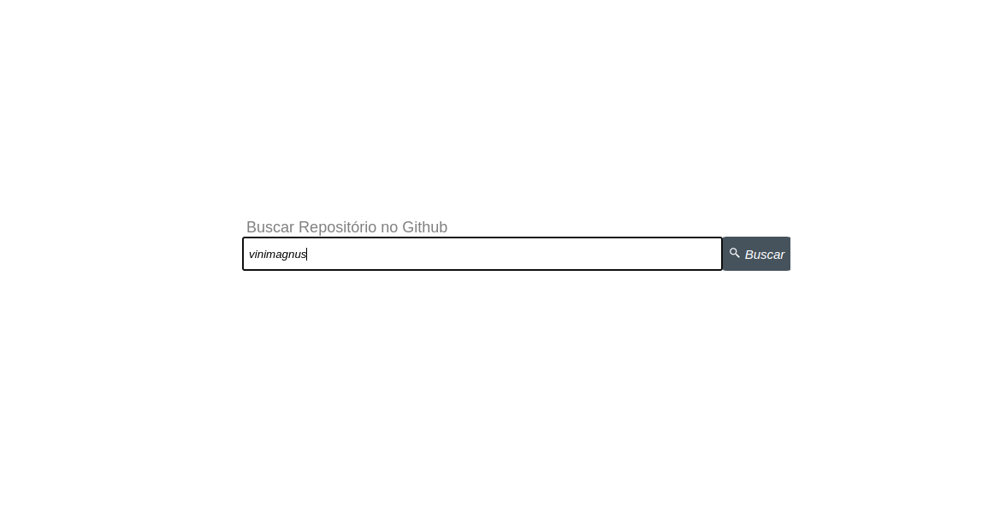
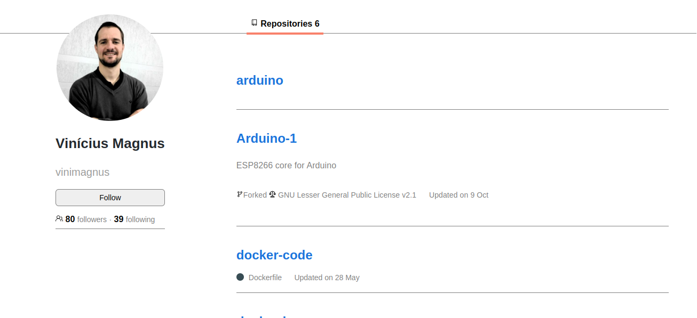

# Desafio React

## Visão geral

### Contextualizando:

Nessa aplicação, fiquei responsável por criar uma tela de pesquisa de usuários do github, onde fosse possível visualizar os repósitorios de cada usuário pesquisado.
Além disso caso a pessoa usuária da aplicação não digitasse nada na barra de pesquisa, uma mensagem de erro deveria ser mostrada e caso o usuário do github pesquisado não exista, aplicação também mostra uma mensagem de erro.

<br />

## Rode em sua maquina

### Modo tradicional

<details>
  <summary><b>Requisitos:</b></summary><br>

  - Ter o `git` instalado em sua máquina;
  - Ter o `npm` instalado em sua máquina;
  
</details>

<details>
  <summary><b>Clonar</b></summary><br>

Para clonar o repositório usando HTTPS:

```
git clone https://github.com/dev-tavares/desafioatlas.git
```

Para clonar usando SSH:

```
git clone git@github.com:dev-tavares/desafioatlas.git
```
</details>

<details>
  <summary><b>Vamos lá</b></summary><br>
 
Entre na pasta do projeto:

```
cd desafioatlas/desafioatlas
```

Instale as dependências do projeto:

```
npm i
```

Crie uma build do projeto

```
npm run build
```

Inicie o projeto:

```
npm start
```

Abra o link abaixo no navegador de sua preferencia:

```
http://localhost:3000/
```
</details>

## Tela de pesquisa:



## Tela de usuário:

